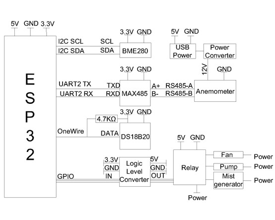
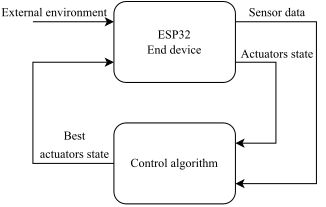
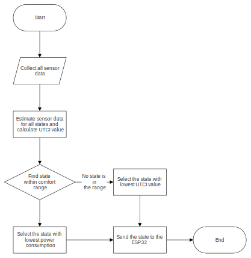
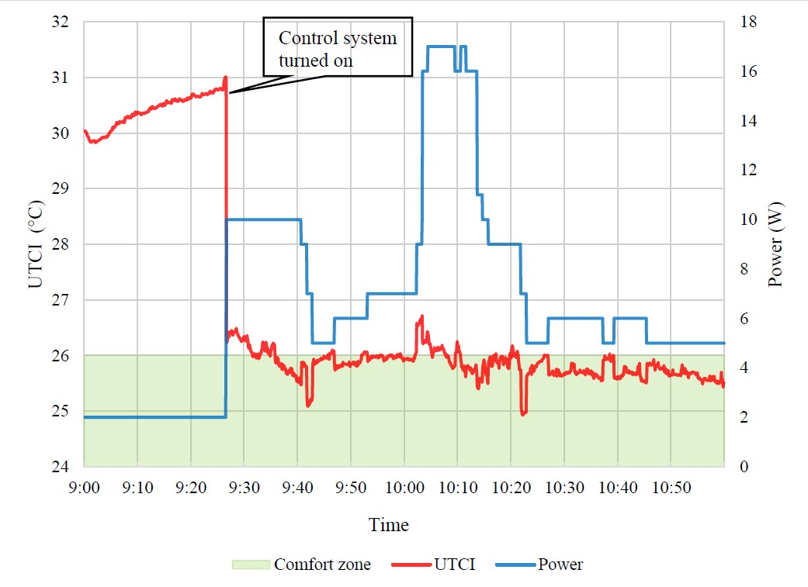
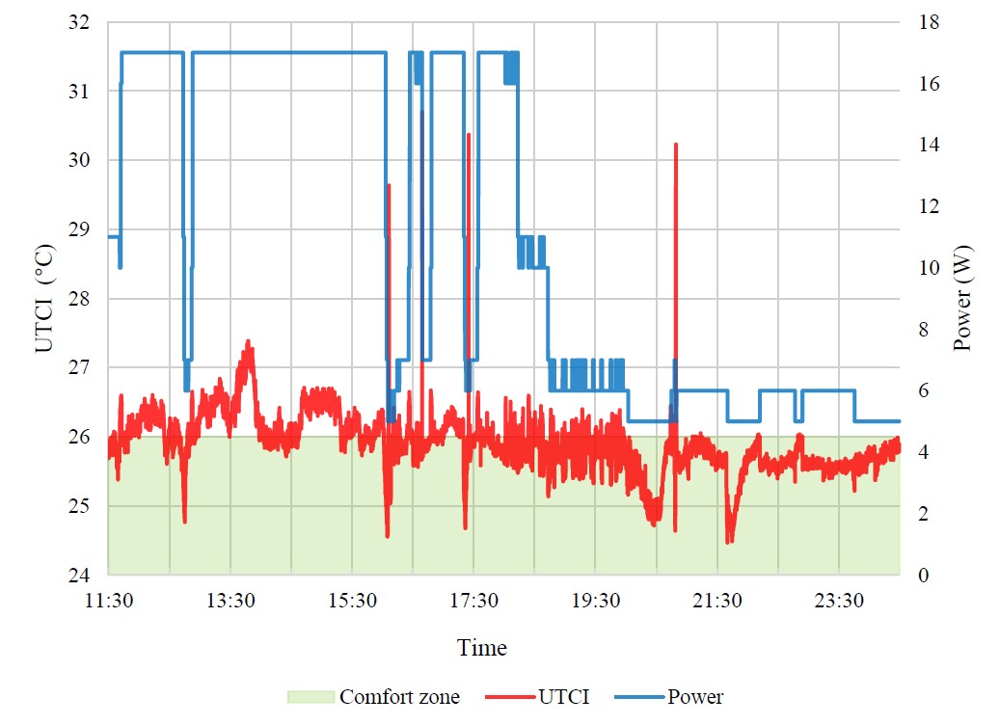
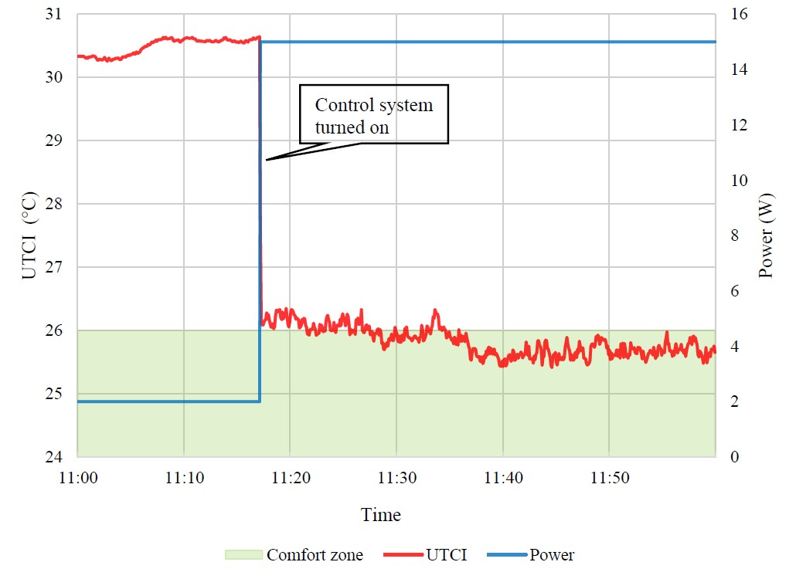

# Climate-control-IoT

A climate control system containing edge device and controller.  
Project Aim: Automatically control shaded outdoor environment to achieve best thermal comfort and power saving.  
Project at College of Design and Engineering, National University of Singapore, 2022

## Files

ctrl.py: Automatic control algorithm  

ctrl_rl_baseline.py: Proof-of-concept reinforcement learning based control

Arduino.ino: ESP-32 firmware  

## Edge device

* ESP-32
* BME280 as air temperature and humidity sensor
* MAX485 and Modbus Anemometer
* DS18B20 as black ball thermometer
* Fan, mist generator and roof cooling system.

Schematic:  

## Control

IoT Server using self-hosted ThingsBoard. Communication using MQTT.

Base control:  

Control flow:  

## Test results

Test done in shaded environment, Singapore.

Automatic control:  

Reinforcement learning based control:

## Credit

utci.py from ladybug-comfort [https://github.com/ladybug-tools/ladybug-comfort]
